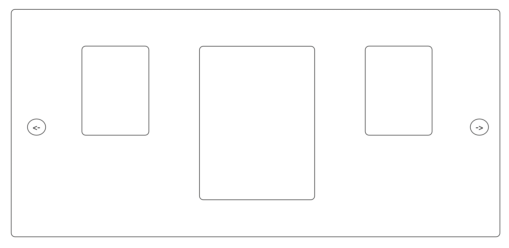

# UAP Principal Technical Test

We've been asked to build a new web app for a new CBeebies game app using the latest best practices! Your task is to create a new web app that displays a carousel of our brands surfaced from one of our APIs.

As the Principal on the team, we'd like you to plan out how you'd achieve this and design an architecture diagram that outlines your solution.

__You should spend no more than 60 minutes on this.__

The second stage of the interview will involve bringing this solution to life, so please ensure your plan is implementable within 2 hours!

## Requirements:

Using modern web technologies, plan how you might build an application that meets the following:

- Given an API endpoint render the brands on screen as per the wireframe requirement included
- Implement animations and transitions using modern web technology so each of the carousel items cycles between the different brands
- Host the application on a web hosting environment of your choosing 

**API Endpoint:** [https://7kowhvjfi7.execute-api.eu-west-1.amazonaws.com/dev/api/brands](https://7kowhvjfi7.execute-api.eu-west-1.amazonaws.com/dev/api/brands)

## Deliverables:

- An implementable plan (do this as a plaintext file)
- A architecture diagram that outlining your solution

Once you've completed this task, please forward your diagram and plan to your recruiter. 

You will be assessed on your ability to break down complex and vague requirements into a concrete plan whilst architecting a high level design on how this may actually be implemented. 

If you’d like to clarify any parts of this assessment or the requirements with your steakholders, please reach out to the recruiter.

## Assessment Criteria:

- Requirements are sufficiently broken down
- Proposed technology is up to date and relevant for the job role 
- The architecture diagram is clear and reflects the high level plan 

## Wireframe

